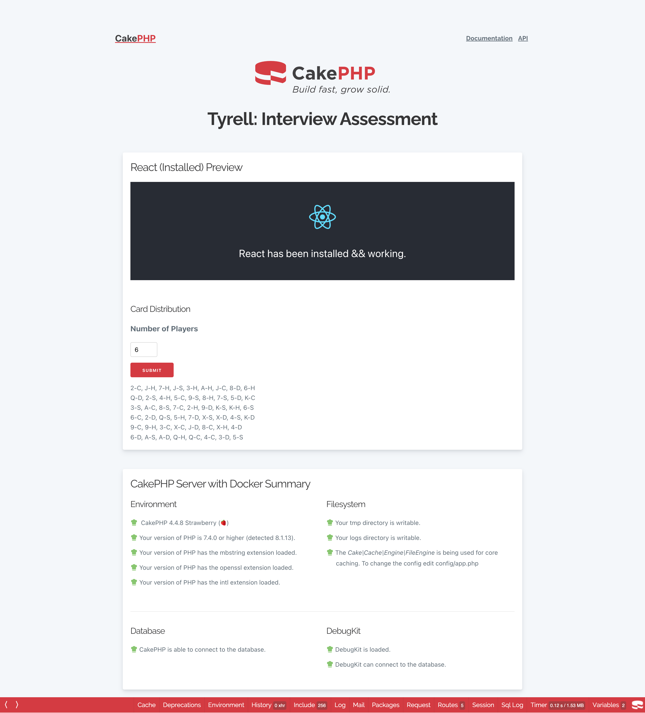

### For assessment task number 1:
The application used:
>- PHP v8.1,
>- CakePHP v4,
>- ReactJS v18,
>- Docker v3.1,
>- MySQL 8, and
>- Node v19

After docker has been executed, the hostname for the application to be called in a web browser is:

```http:://localhost:8001```

> More info of the environment could be found inside the docker-compose.yml in the root directory.

The front page of the application shall show the CakePHP page with ReactJS. The card distribution task is located within this page.

The frontpage also shows the report of the CakePHP and database connection status.



User could enter the number of players and click submit to distribute the cards accordingly as required.

For the first assessment the man hour taken is 3 hour.

### For assessment task number 2:
The SQL table could be migrated using CakePHP command below after docking at the CakePHP app folder:

	bin/cake migrations migrate

The SQL could be enhance by:

1. Add index to the columns which were used for joining and columns which shows status. As an example, the columns 'publish_status' and 'id' in the jobs table could be indexed together to allow the query to search for status faster. In the CakePHP migration file, I have already put the indexes for all columns used.

2. Avoid LIKE Searches With Leading Wildcard (%) as the database will not use an index when using like searches with a leading wildcard (e.g. '%キャビンアテンダント%'). Although it's not always a satisfactory solution, please consider using prefix-match LIKE patterns (e.g. 'TERM%').

3. Avoid OFFSET In LIMIT Clause as OFFSET clauses can be very slow when used with high offsets (e.g. with high page numbers when implementing paging). Instead, use the following seek method, which provides better and more stable response rates.

After executing the script, the time taken is below 1s.

For the second assessment the man hour taken is 1hour as using CakePHP to create the database is quite fast.
